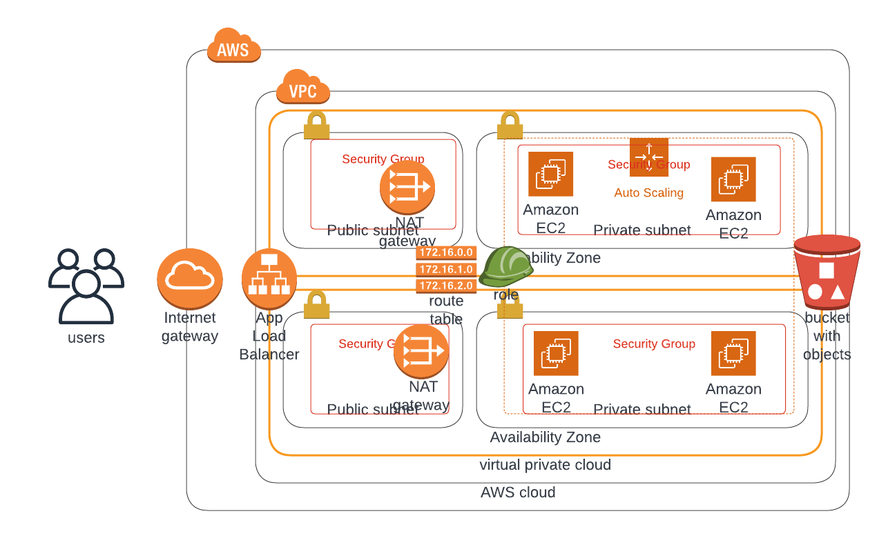

# Udacity CloudFormation Project
Your company is creating an Instagram clone called Udagram.
Developers want to deploy a new application to the AWS infrastructure.
You have been tasked with provisioning the required infrastructure and deploying a dummy application, along with the necessary supporting software.
This needs to be automated so that the infrastructure can be discarded as soon as the testing team finishes their tests and gathers their results.

## Project Diagram

## Load Balancer to Live Project
This is the DNS name to the live web app [Udagram App](http://Udagr-WebAp-1TT7TWEQDU6XB-2087003120.us-west-2.elb.amazonaws.com).